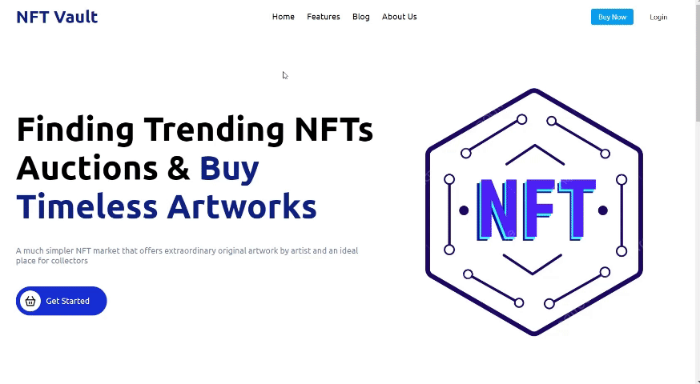

## **Table of Contents**

1. [Description](https://chat.openai.com/c/f59dc7f7-9291-4b9b-8097-d5d1f2d3986c#description)
2. [Features](https://chat.openai.com/c/f59dc7f7-9291-4b9b-8097-d5d1f2d3986c#features)
3. [Demo](https://chat.openai.com/c/f59dc7f7-9291-4b9b-8097-d5d1f2d3986c#demo)
4. [Contributing](https://chat.openai.com/c/f59dc7f7-9291-4b9b-8097-d5d1f2d3986c#contributing)

## **Description**

This project is an HTML/CSS NFT website aiming to replicate the layout and structure of a basic NFT website main page. It utilizes HTML for the structure and CSS for styling, replicating several key components such as the header, navigation bar, market section, super hot sections, and footer. The layout is responsive and designed to adapt to different screen sizes.

## **Features**

- Navbar with essential functionalities such as Home, Features, Blog, and About Us.
- Market section displaying a message and an image.
- Product section showcasing different product categories with "See More" links.
- Footer with various sections including navigation links, social media links, and legal information.

## **Demo**



### **Clone the repository:**

Open the project in your preferred code editor:

```bash
bashCopy code
git clone https://github.com/surendar-05/NFT-Website.git

```

## **Contributing**

Contributions are welcome! If you find any issues or want to enhance the project:

1. Fork the repository.
2. Create your feature branch (**`git checkout -b feature/YourFeature`**).
3. Commit your changes (**`git commit -am 'Add some feature'`**).
